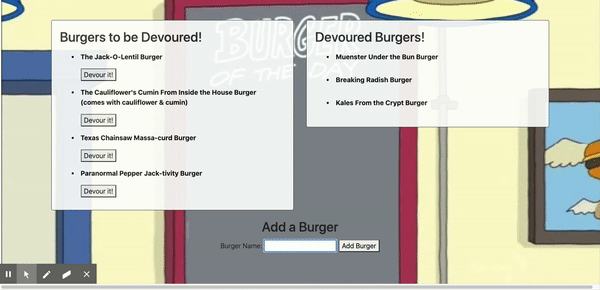

# EAT-DA-BURGER!
  
  ## Description
  Eat-Da-Burger allows the user to add the name of a burger to the burger list. Then select the devour button to devour their desired burger. The burger name will then be moved to the list of devoured burgers.
  ## Table of Contents
  1. [Installation](#installation)
  2. [Usage](#usage)
  3. [License](#license)
  4. [Contributing](#contributing)
  5. [Tests](#tests)
  6. [Questions](#questions)
  ## Installation
  follow the link to heroku for this app.

  [Eat-Da-Burger](https://warm-hollows-76393.herokuapp.com/)
  ## License
  The license type chosen for this app is:

  **None**
  
  For more details on this license type please use the following link: 

  https://opensource.org/osd-annotated
  ## Contributing
  
  ## Tests
  Download the files from the repository and run npm i to install the required nodes. then run node server and navigate a browser to http://localhost:8080/. Then add a burger name and select the devour button to verify that the name moves from "to be devoured" to "devoured burgers".

  
  ## Questions
  If you have any questions please feel free to contact me via the links below:
  * GitHub: [DanielGerrald](https://github.com/DanielGerrald)
  * E-Mail: daniel.gerrald@icloud.com